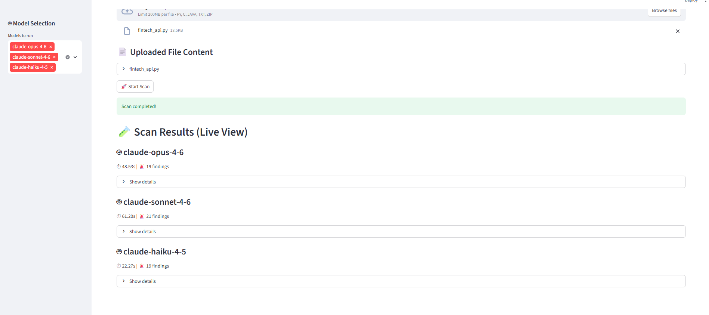
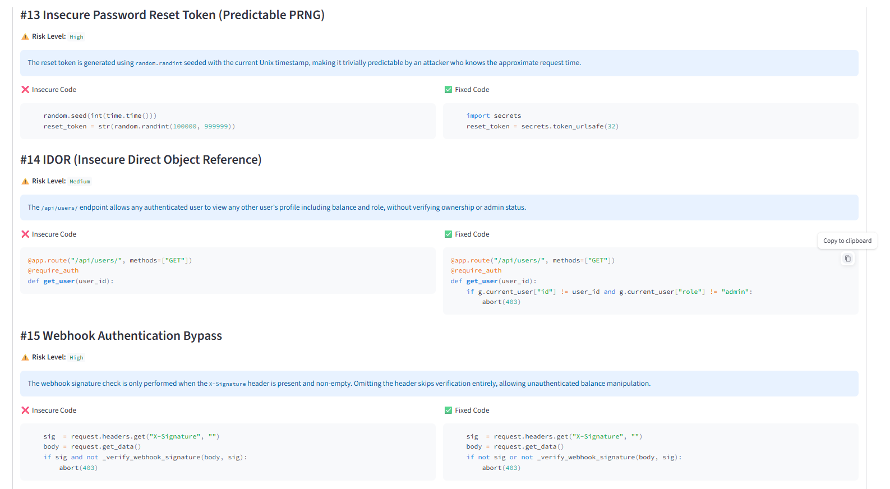
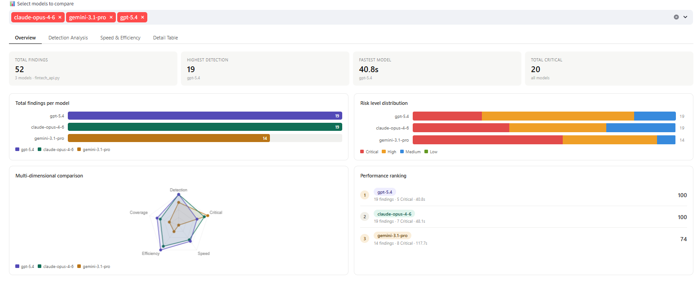

<div align="center">
  <h1>Prompt-Based Security Analyzer</h1>
  <p><b>Advanced SAST Tool Powered by LLMs (GPT-5, Claude 4, Gemini 3)</b></p>

  
  
  
  
  
  
  <br />
  <br />
</div>

> **Prompt-Based Security Analyzer** is a high-performance security analysis tool featuring a built-in benchmarking and dashboard interface. It leverages state-of-the-art Large Language Models (LLMs) to perform Static Application Security Testing (SAST) on both individual files and entire project structures.


---

## Interface Previews

**1. Real-time Scan Execution & ZIP Upload**


**2. Detailed Vulnerability Analysis & Remediation**


**3. Multi-Model Benchmark Dashboard**


---
## Key Features

* **Advanced Project Structures:** Supports analysis of entire projects via `.zip` uploads, allowing models to understand the broader context and directory structure of your application.
* **Hybrid Analysis Strategy:** Capable of processing files individually to prevent high input token usage in massive projects, ensuring cost-efficiency while maintaining deep security coverage.
* **Multi-Model Support:** Send your code to GPT-5.x, Claude 4.x, and Gemini 3.x models simultaneously with a single click to cross-validate security analysis.
* **Interactive Dashboard:** Analyze model performances with radar charts, bar graphs, and detailed finding tables via a custom Streamlit interface integrated with Chart.js.
* **Bulletproof JSON Parser:** Features a custom regex/parser engine that surgically extracts JSON arrays, even if the LLM generates markdown, conversational text, or reasoning tags.
* **Wallet Shield:** Built-in safeguards (`max_tokens` limits and `reasoning_effort="low"`) to prevent advanced reasoning models from entering infinite thinking loops and draining your API budget.
* **SQLite Integration:** Automatically logs past scan results, including detected vulnerabilities with "Insecure" and "Fixed" code snippets, into a local database.

---

## Installation

Follow these steps to set up the project on your local machine:

**1. Clone the Repository:**
```bash
git clone [https://github.com/yourusername/PromptSecurityAnalyzer.git](https://github.com/yourusername/PromptSecurityAnalyzer.git)
cd PromptSecurityAnalyzer
```

**2. Create and Activate a Virtual Environment:**
```bash
python -m venv venv
# For Windows:
venv\Scripts\activate
# For Mac/Linux:
source venv/bin/activate
```

**3. Install Dependencies:**
```bash
pip install -r requirements.txt
```

**4. Set Up Environment Variables:**
Create a `.env` file in the root directory and add your API keys:
```env
OPENAI_API_KEY=sk-your-openai-key
ANTHROPIC_API_KEY=sk-ant-your-claude-key
GOOGLE_API_KEY=AIza-your-gemini-key
```

---

## Usage

To start the application, run the following command in your terminal:

```bash
streamlit run web_app.py
```

In the web interface:
1. **Select the AI models** you want to use for the scan from the sidebar.
2. Go to the **Code Scanner** tab, upload your source file or a **ZIP archive** containing your project.
3. Click "Start Scan". The system will process the project structure and provide model-specific insights.
4. Switch to the **Benchmark & Dashboard** tab to compare performance and review remediation strategies.

---

## Supported Models

The LLM Gateway actively supports the following APIs:
### Google Gemini
* **gemini-3.1-pro** 
* **gemini-3-flash** 
* **gemini-2.5-pro**
* **gemini-2.5-flash** 

### OpenAI GPT
* **gpt-5.4**
* **gpt-5.3** 
* **gpt-5.2**
* **gpt-4.1** / **gpt-4.1-mini**

### Anthropic Claude
* **claude-sonnet-4-6**
* **claude-opus-4-6**
* **claude-haiku-4-5**

---

## Disclaimer

This tool uses AI models for static code analysis. LLMs can occasionally "hallucinate" (report non-existent vulnerabilities or miss existing ones). This tool is designed to augment and support—not replace—manual security audits, penetration testing, and traditional SAST tools.

---

<div align="center">
  <b>Developed by Emre Akkaya</b>
</div>
